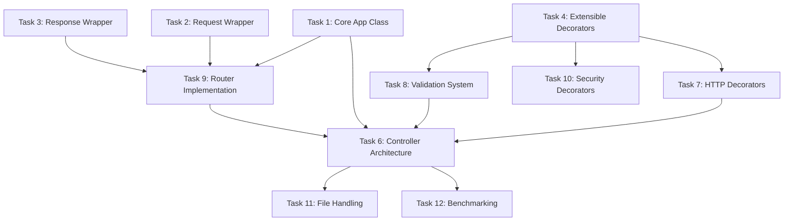

# Voltrix Monorepo - Consolidated Task Overview

## 🚀 High Priority Tasks (Current Sprint)

### EXPRESS Package Tasks (@voltrix/express)

#### Task 1: Core Application Class
**Package:** `@voltrix/express`  
**Priority:** High | **Estimated:** 2-3 hours  
**Status:** Not Started

**Requirements:**
- Express method chaining: `app.get().post().listen()`
- HTTP method handlers: GET, POST, PUT, DELETE, PATCH, OPTIONS
- Middleware registration: `app.use(middleware)`
- Server listening: `app.listen(port, callback)`
- Integration with uWebSockets.js App instance

**Success Criteria:**
- [ ] All Express HTTP methods implemented
- [ ] Method chaining works correctly
- [ ] Basic middleware execution pipeline
- [ ] Server starts and accepts connections
- [ ] No memory leaks in basic usage

**Implementation Notes:**
- Use uWebSockets.js `App()` as the underlying server
- Implement unified request handler for all HTTP methods
- Set up basic error handling for malformed requests

---

#### Task 2: Request Wrapper Class
**Package:** `@voltrix/express`  
**Priority:** High | **Estimated:** 2-3 hours  
**Status:** Not Started

**Requirements:**
- Express-compatible properties: `method`, `url`, `headers`, `query`, `params`
- Header access methods: `req.get()`, `req.header()`
- Query parameter parsing from URL
- Route parameter extraction (to be integrated with router)
- Body parsing preparation (stream-based for large payloads)

**Success Criteria:**
- [ ] All Express request properties available
- [ ] Header access case-insensitive like Express
- [ ] Query parsing handles URL encoding properly
- [ ] No data copying unless necessary (performance)
- [ ] Memory efficient - no leaks after request completion

**Performance Targets:**
- Query parsing < 0.1ms for typical URLs
- Header access < 0.05ms per header
- Memory allocation < 1KB per request object

---

#### Task 3: Response Wrapper Class  
**Package:** `@voltrix/express`  
**Priority:** High | **Estimated:** 2-3 hours  
**Status:** Not Started

**Requirements:**
- Express response methods: `res.json()`, `res.send()`, `res.status()`
- Header manipulation: `res.set()`, `res.get()`, `res.append()`
- Streaming support: `res.pipe()`, chunked responses
- Error handling and status codes
- Integration with uWS response object

**Success Criteria:**
- [ ] All Express response methods implemented
- [ ] Streaming responses work correctly
- [ ] Proper error handling for network issues
- [ ] No response corruption under load
- [ ] Backpressure handling for large responses

---

### DECORATOR Package Tasks (@voltrix/decorator)

#### Task 4: Extensible Decorator System
**Package:** `@voltrix/decorator`  
**Priority:** High | **Estimated:** 4-5 hours  
**Status:** Partially Implemented

**Requirements:**
- Base decorator class with `.extend()` method
- Custom decorator factory functions  
- Metadata caching with LRU eviction
- Type-safe reflection system using symbols
- Support for decorator composition

**Success Criteria:**
- [ ] Base decorator class implemented
- [ ] `.extend()` method works for all decorators
- [ ] Custom decorators can be created via factory
- [ ] Metadata caching shows performance improvement
- [ ] Type safety maintained throughout system

**Implementation Notes:**
```typescript
// Target API
const CustomAuth = Auth.extend({
  strategy: 'jwt',
  secret: 'my-secret'
});

@CustomAuth()
class MyController {}
```

---

#### Task 5: Dependency Injection Container
**Package:** `@voltrix/decorator`  
**Priority:** High | **Estimated:** 3-4 hours  
**Status:** Not Started

**Requirements:**
- High-performance DI container
- Singleton pattern support
- Lazy initialization of services
- Circular dependency detection
- Memory-efficient instance management

**Success Criteria:**
- [ ] Container can resolve dependencies
- [ ] Singleton services work correctly
- [ ] Lazy initialization prevents startup overhead
- [ ] Circular dependencies detected and prevented
- [ ] Memory usage scales linearly with service count

**Performance Targets:**
- Service resolution < 0.01ms for cached instances
- Container initialization < 5ms for 100 services
- Memory overhead < 1KB per registered service

---

#### Task 6: Controller Architecture & Routing
**Package:** `@voltrix/decorator`  
**Priority:** High | **Estimated:** 3-4 hours  
**Status:** Partially Implemented

**Requirements:**
- `@Controller` decorator with modular routing
- Route metadata extraction and compilation
- Middleware integration with Express pipeline
- Parameter binding system (@Params, @Query, @Body)
- Route prefix and versioning support

**Success Criteria:**
- [ ] `@Controller` decorator works with Express routing
- [ ] Route metadata properly extracted
- [ ] Middleware executes in correct order
- [ ] Parameter binding works for all types
- [ ] Route prefixes and versioning functional

---

## 🔧 Medium Priority Tasks

#### Task 7: HTTP Method Decorators
**Package:** `@voltrix/decorator`  
**Priority:** Medium | **Estimated:** 2-3 hours  
**Status:** Partially Implemented

**Requirements:**
- Complete implementation of `@GET`, `@POST`, `@PUT`, `@DELETE`, `@PATCH`, `@OPTIONS`
- Route parameter extraction from decorator paths
- Integration with Express routing system
- Support for route patterns and wildcards

#### Task 8: Validation System Integration
**Package:** `@voltrix/decorator`  
**Priority:** Medium | **Estimated:** 4-5 hours  
**Status:** Not Started

**Requirements:**
- Multi-validator support (Zod, class-validator, JSON Schema)
- `@Body`, `@Query`, `@Params`, `@Header`, `@Cookie` decorators
- Performance-optimized validation pipeline
- Custom validation error handling

#### Task 9: Router Implementation
**Package:** `@voltrix/express`  
**Priority:** Medium | **Estimated:** 3-4 hours  
**Status:** Not Started

**Requirements:**
- High-performance route pattern matching
- Parameter extraction and type conversion
- Middleware integration per route
- Route conflict detection

---

## 🔍 Low Priority Tasks

#### Task 10: Security Decorators
**Package:** `@voltrix/decorator`  
**Priority:** Low | **Estimated:** 3-4 hours  

**Requirements:**
- `@Auth`, `@Role`, `@Permission`, `@RateLimit` decorators
- JWT token validation
- Role-based access control
- Rate limiting with Redis backend

#### Task 11: File Handling System
**Package:** `@voltrix/decorator`  
**Priority:** Low | **Estimated:** 4-5 hours  

**Requirements:**
- `@Upload`, `@Download`, `@FileStream` decorators
- Multiple storage backend support (local, S3, etc.)
- Streaming file transfers
- File validation and type checking

#### Task 12: Performance Benchmarking
**Package:** `@voltrix/benchs`  
**Priority:** Low | **Estimated:** 2-3 hours  

**Requirements:**
- Comprehensive benchmarks vs Express/Fastify
- Memory usage profiling
- Load testing scenarios
- Performance regression detection

---

## 📋 Task Dependencies



## 🎯 Sprint Planning

### Current Sprint (Week 1)
**Focus:** Core Framework Foundation
- Task 1: Core Application Class (Express)
- Task 2: Request Wrapper Class (Express)
- Task 4: Extensible Decorator System (Decorator)

### Next Sprint (Week 2)  
**Focus:** Response Handling & DI Container
- Task 3: Response Wrapper Class (Express)
- Task 5: Dependency Injection Container (Decorator)
- Task 6: Controller Architecture (Decorator)

### Future Sprints
**Focus:** Feature Completion & Optimization
- HTTP Method Decorators (Task 7)
- Validation System (Task 8)
- Router Implementation (Task 9)
- Security & File Handling (Tasks 10-11)
- Performance Benchmarking (Task 12)

---

## 🚨 Blocking Issues & Risks

### Technical Risks
1. **uWebSockets.js Integration** - Memory management complexity
2. **Performance Targets** - Meeting 50%+ improvement over Fastify
3. **Express Compatibility** - Maintaining API compatibility while optimizing
4. **Decorator Overhead** - Ensuring zero-overhead abstractions

### Resource Dependencies  
1. **Metadata System** - Need reflect-metadata stable integration
2. **Testing Infrastructure** - Performance benchmarking setup
3. **Documentation** - API documentation generation

### Mitigation Strategies
- Implement comprehensive error handling for uWS integration
- Set up continuous performance monitoring
- Create compatibility test suite against Express
- Profile decorator runtime overhead continuously